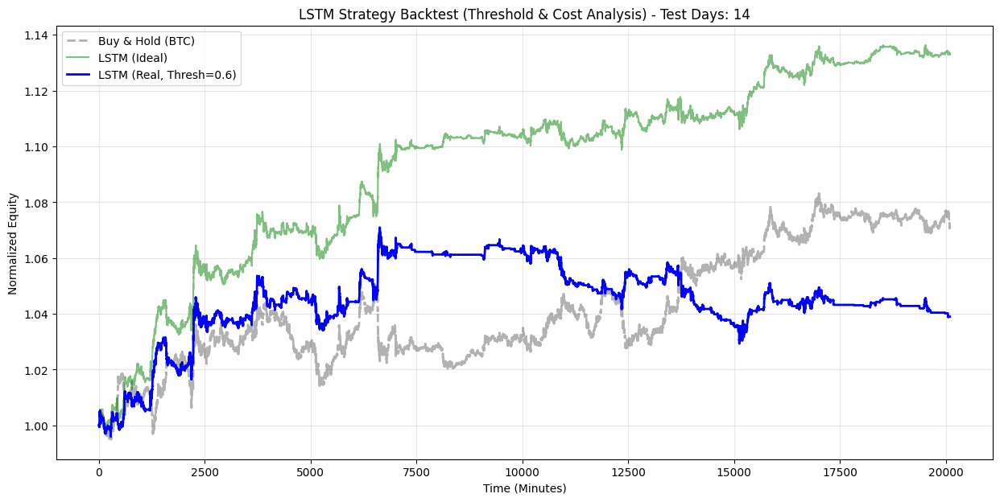
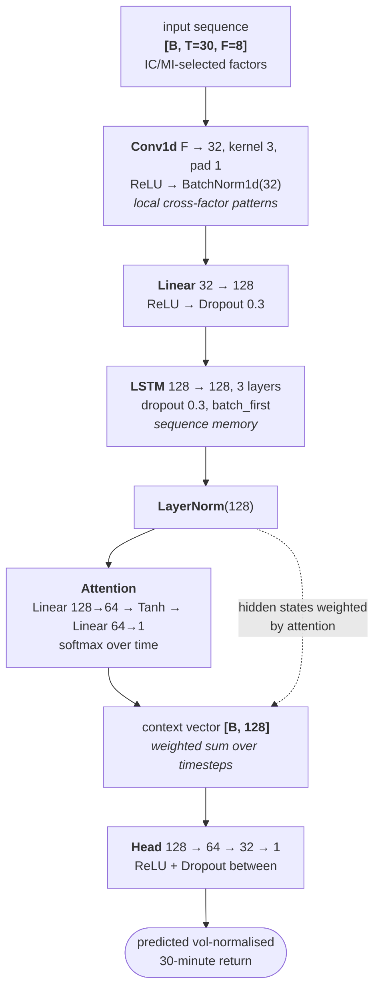
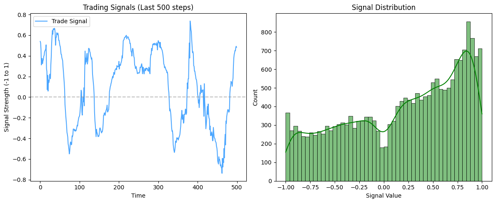

# Minute-Level Bitcoin Predictive Signal Modeling

Predicting short-horizon Bitcoin returns from minute-level data, and testing whether
the prediction survives contact with trading costs.

Five model families — OLS/Ridge/Lasso, ARIMA, XGBoost and a CNN–LSTM with attention —
are trained on the same features, converted to positions through the same signal
rule, and scored by the same backtester, so the comparison between them is like for
like. The headline finding is not that any model is highly profitable; it is that
**only the CNN–LSTM keeps a positive Sharpe once transaction costs are charged**,
while every other model turns negative.

> **Context.** MF703 course project (Boston University, Questrom MSMFT), by a
> five-person team: Yizhou Qian, Han Zheng, Tingrui Zhang, Zhankai Zhang, Yixuan Wang.
> This repository is research code, not investment advice.

---

## Contents

[Results](#results) · [CNN–LSTM architecture](#cnnlstm-architecture) · [Signal and backtest](#signal-and-backtest) ·
[Feature pipeline](#feature-pipeline) · [Data](#data) · [Running it](#running-it) · [Layout](#layout) · [Limitations](#limitations)

---

## Results

Every model is evaluated on the same out-of-sample minute-level window — 14 days,
about 20,000 minutes — from a single merged signals file, by
`backtesting/backtesting_main.ipynb`. The benchmark is buy-and-hold BTC.



The whole argument of this project is in that chart. **Green** is the CNN–LSTM with
no trading costs: +13.3% over the window, comfortably ahead of the **grey**
buy-and-hold at +7.2%. **Blue** is the same model and the same predictions with a
0.6 entry threshold and costs charged on turnover: +4.0%, now *behind* buy-and-hold.

Nothing about the model changed between the green and blue lines. The entire gap is
execution cost, and at minute frequency that gap is larger than the edge.

**Frictionless (`cost_rate = 0`)**

| | Sharpe | Sortino | Max DD | CVaR (5%) |
|---|---:|---:|---:|---:|
| **CNN–LSTM** | **0.333** | 0.400 | −1.58% | −0.00070 |
| benchmark (buy & hold) | 0.145 | 0.191 | −2.88% | −0.00087 |
| ARIMA | 0.130 | 0.144 | −2.23% | −0.00064 |
| XGBoost | 0.080 | 0.084 | −3.87% | −0.00063 |
| Ridge | 0.009 | 0.010 | −1.34% | −0.00034 |

**With transaction costs**

| | Sharpe | Sortino | Max DD |
|---|---:|---:|---:|
| benchmark (buy & hold) | 0.145 | 0.191 | −2.88% |
| **CNN–LSTM** | **0.107** | 0.102 | −3.89% |
| Ridge | −0.106 | −0.034 | −1.70% |
| ARIMA | −0.241 | −0.188 | −9.17% |
| XGBoost | −0.845 | −0.665 | −23.29% |

Two things are worth reading carefully:

- **Costs dominate at this frequency.** Turnover is charged at `cost_rate` per unit
  of position change (`backtest_strategy` in `models/cnn_lstm/backtesting.py`).
  A minute-level strategy trades constantly, so a frictionless Sharpe says very
  little on its own — XGBoost goes from +0.08 to −0.84 on costs alone.
- **The benchmark is not cost-sensitive.** Buy-and-hold has almost no turnover, so
  its Sharpe is identical in both tables. Comparing a frictionless high-turnover
  strategy against it would flatter the strategy; the honest comparison is
  model-versus-model under the same cost assumption, where the CNN–LSTM is the only
  survivor.

Directional accuracy on the CNN–LSTM: **52.91% win rate** on t+30m, against 52.05%
for XGBoost and 45.9% for the linear models.

---

## CNN–LSTM architecture

A 1D convolution compresses each timestep's factor vector into local patterns, a
stacked LSTM carries state across the sequence, and an attention head pools the
sequence into one vector instead of taking only the final hidden state.



**Why each piece is there**

- **Conv1d before the LSTM.** Raw minute bars are noisy; a width-3 convolution
  smooths and mixes factors locally, so the recurrent layer receives a denoised
  representation rather than tick-level jitter.
- **Attention instead of the last hidden state.** A plain LSTM decides from `h_T`,
  which over a 30-minute window discards most of what it saw. Attention learns a
  weighting across all timesteps, so a decisive bar 20 minutes back can still drive
  the prediction.
- **Normalisation at two levels.** BatchNorm after the convolution stabilises channel
  scale; LayerNorm after the LSTM stabilises across the feature dimension, which
  matters because financial inputs shift distribution from regime to regime.
- **Initialisation.** LSTM input weights use Xavier uniform, recurrent weights use
  orthogonal init (keeps gradients from exploding across 30 timesteps), and the
  **forget-gate bias is set to 1.0** so the network starts out remembering rather
  than forgetting.
- **RMSE loss** rather than MSE, so the loss stays on the target's scale and is less
  dominated by the fat tail of minute-level returns.

**Hyperparameters** come from a 20-trial random search over learning rate, hidden
width, depth, dropout, batch size and sequence length. Best configuration:

| | |
|---|---|
| optimiser | Adam, lr 5e-4, `weight_decay` 3e-3, `ReduceLROnPlateau` |
| hidden dim / layers | 128 / 3 |
| dropout | 0.3 |
| batch size | 64 |
| sequence length | 30 minutes |
| best validation loss | 7.923 (RMSE on the scaled target) |

Training uses ~346k sequences with ~20k held out. The split is chronological and
never shuffled, so no future bar can leak into training.

---

## Signal and backtest

Predictions are continuous, so they are squashed through `tanh` into a position in
`[-1, 1]`: the sign gives direction and the magnitude gives conviction, so position
size scales with confidence instead of flipping between fully long and fully short.



`backtest_strategy` then applies an optional entry threshold (trade only when
`|signal| > threshold`, suppressing low-conviction churn), computes turnover as the
absolute change in position, and charges `turnover × cost_rate`. The two tables above
are the same function called with `cost_rate = 0` and `cost_rate > 0`.

The threshold is the one lever that matters once costs are real: raising it from 0 to
0.6 cuts turnover sharply, which is why the cost-charged line in the backtest above
uses it. Trading every marginal signal is what destroys the other four models.

---

## Feature pipeline

Two feature sets exist, for two purposes.

**`feature_engineering_icir/` — 29 hand-built microstructure factors** (momentum
`MOM_3/5/10`, z-scored momentum, realised volatility `VOL_5/30/60`, volume ratios and
similar), used for standalone IC/ICIR screening across ~346k rows.

**`models/cnn_lstm/` — the model-facing pipeline**, which generates a much wider
candidate set and then prunes it hard:

| Stage | Features |
|---|---:|
| Generated — lags 1–30 on OHLCV and 5 external assets, SMA/EMA ×5, MACD, RSI ×3, VWAP + dispersion, candle geometry, volume dynamics, RSI slope | **133** |
| Pass IC or MI threshold (`abs(IC) > 0.01` or `MI > 0.005`) | **72** |
| After redundancy pruning (drop the lower-IC side of any pair with \|corr\| > 0.90) | **7** |

Selection uses three complementary criteria, in `LstmFactorAnalyzer`:

- **IC / ICIR** — Spearman rank IC against the target, plus a 500-period rolling IC
  whose mean/std gives ICIR, so a factor is judged on stability rather than only on
  average correlation.
- **Mutual information** — catches non-linear dependence that rank correlation
  misses.
- **Redundancy pruning** — between two features correlated above 0.90, the one with
  the weaker \|IC\| is dropped.

Cutting 133 candidates to 7 is the point, not an accident: at minute frequency most
engineered features are near-duplicates of one another, and handing all of them to a
sequence model mostly buys overfitting.

**Target construction** matters as much as the features. The label is a forward
30-minute cumulative log return, then **divided by trailing realised volatility**
(30-period, shifted one bar), winsorised at the 1st/99th percentiles, and passed
through a `RobustScaler`. Volatility-normalising the target stops calm and turbulent
regimes from being weighted as though a 5 bp move meant the same thing in both. Every
rolling statistic is shifted before use, so no feature sees its own bar.

---

## Data

Minute-level OHLCV for BTC/USD, aligned against ETH/USD, EUR/USD, GLD, SPY and VIXY.
Crypto trades 24/7 while the traditional assets do not, so `data_processing/data_loader.py`
aligns everything to the BTC timeline, converts to US/Eastern, fills the traditional
assets only inside their own sessions, and emits a validity mask per asset rather
than silently interpolating across a closed market.

**The CSVs are not in this repository** — they are large and gitignored. The
notebooks expect them under `data/`:

```
data/btcusd_1-min_data.csv
data/ETH_USD_1min_2020_2025.csv
data/SPY_1min_2020_2025.csv
data/EUR_USD_1min_2020_2025.csv
data/GLD_1min_2020_2025.csv
data/VIXY_1min_2020_2025.csv
```

The two model families use different history windows: ARIMA and the linear models
load from 2020, the CNN–LSTM and XGBoost from 2025. The final backtest re-aligns
every model's signals onto one common index, so the comparison above is still
same-period.

---

## Running it

```bash
python -m venv .venv && source .venv/bin/activate
pip install -r requirements.txt          # TA-Lib needs the C library first: brew install ta-lib
```

Place the CSVs under `data/` (see [Data](#data)), then run the notebooks:

| Notebook | What it does |
|---|---|
| `eda/eda_main.ipynb` | Stationarity, return distribution, volatility clustering, cross-asset correlation |
| `feature_engineering_icir/New_factors_IC_ICIR_Test.ipynb` | Builds the 29 microstructure factors and screens them on IC/ICIR |
| `models/linear_lasso_ridge/ols_lasso_ridge_main.ipynb` | OLS / Ridge / Lasso baselines |
| `models/arima/arima_main.ipynb` | ARIMA baseline |
| `models/xgboost/xgboost_main.ipynb` | Gradient-boosted baseline |
| `models/cnn_lstm/cnn_lstm_main.ipynb` | Feature selection, hyperparameter search, training, evaluation |
| `backtesting/backtesting_main.ipynb` | Merges every model's signals and produces the tables above |

Each model directory keeps its own `data_loader.py` so its notebook runs standalone;
they differ only in the history window described under [Data](#data).

---

## Layout

```
data_processing/data_loader.py       multi-asset alignment, timezone and session handling
eda/                                 exploratory analysis
feature_engineering_icir/            29 microstructure factors + IC/ICIR screening
models/
  common_modeling.py                 shared metrics and training utilities
  linear_lasso_ridge/                OLS / Ridge / Lasso
  arima/                             ARIMA
  xgboost/                           gradient boosting
  cnn_lstm/
    cnn_lstm.py                      model, target processor, feature processor, factor analyzer
    modeling.py                      training loop
    backtesting.py                   signal squashing + cost-aware backtest
backtesting/                         unified cross-model backtest
docs/SatoshiLab_FinalReport.pdf      42-page project report
```

---

## Limitations

1. **Costs are modelled as a flat rate on turnover.** No spread, no market impact, no
   queue position — at minute frequency on a volatile asset, real execution would be
   worse than the cost-charged table suggests, not better.
2. **One out-of-sample window.** The evaluation is a single chronological holdout,
   not a walk-forward or purged cross-validation, so the ranking between models
   carries more variance than the decimal places imply.
3. **Feature selection uses the full sample.** IC, MI and correlation pruning are
   computed before the train/test split, which leaks a small amount of test-set
   information into which features were chosen.
4. **No regime conditioning.** The models are trained across the whole window with no
   separate treatment of trending versus mean-reverting regimes, and crypto changes
   character quickly.
5. **Not a trading system.** There is no execution layer, no position or risk limits
   and no live data path — this is a modelling study.

---

## License

Academic coursework, shared for reference.
